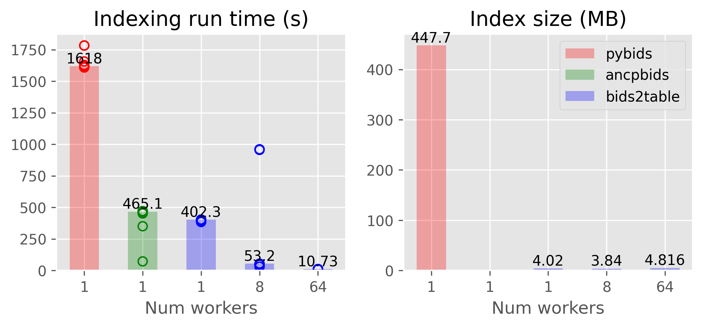

# Indexing benchmark

In this benchmark we compare the indexing performance for [PyBIDS](https://github.com/bids-standard/pybids), [ancpBIDS](https://github.com/ANCPLabOldenburg/ancp-bids), and [bids2table](https://github.com/childmindresearch/bids2table) using the raw data from the [NKI Rockland Sample](https://fcon_1000.projects.nitrc.org/indi/pro/nki.html) (1334 subjects, 1.5TB).

## Setup environment

First install each library in a separate environment using the [setup_environments.sh](setup_environments.sh) script. The main libraries are pinned to the following versions.

- PyBIDS: 0.16.0
- ancpBIDS: 0.2.2
- bids2table: 0.1.dev29+gb7b1658

## Run benchmark

The [benchmark_indexing.py](benchmark_indexing.py) script runs the benchmark. We ran the benchmark on the [PSC bridges2](https://www.psc.edu/resources/bridges-2/) HPC system. The SLURM job scripts for each library are included in this directory.

## Results

We evaluated the indexing performance in terms of run time and index size on disk. We evaluated single-threaded performance for each method, as well as the parallel speedup for bids2table. We report the median for 10 runs.

In terms of single-threaded run time, bids2table is ~4x faster than PyBIDS and ~15% faster than ancpBIDS. In addition, the parallel speedup for bids2table is nearly linear. With 64 workers available, bids2table is ~150x faster than PyBIDS and ~35x faster than ancpBIDS.

In terms of index size, bids2table requires ~90x less disk space than PyBIDS, thanks to the efficient compression used by the [Parquet file format](https://parquet.apache.org/). The index size of ancpBIDS could not be compared, since it does not appear to support persisting the index to disk.

